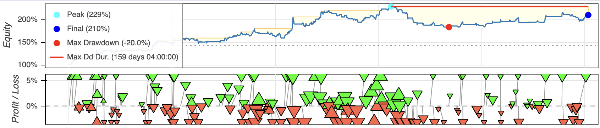

# Alpha Barrier
Transformer-based Bitcoin Direction Classifier with Triple Barrier Labeling

Alpha Barrier is a deep learning model for financial time series classification, built on a Transformer architecture and volatility-adaptive triple barrier method.
It predicts short-term directional bias (Up / Sideways / Down) for Bitcoin based on multi-timeframe technical indicators, ATR-driven volatility measures, and halving-cycle macro signals. Most technical indicators are computed using [Pandas TA](https://pypi.org/project/pandas-ta/).

**Disclaimer**: This work represents a proof of concept. While the project provided useful insights, its empirical performance fell short of expectations. It is published here to document the approach and support future work.
## Architecture
```
┌──────────────────────┐   ┌──────────────────────┐   ┌────────────────────────────┐  
│  Input Sequences     │ → │  Embedding Layer     │ → │  Positional Encoding       │ 
│ (batch, seq_len, Nf) │   │ Linear(Nf → d_model) │   │ Adds temporal signal (sin) │
└──────────────────────┘   └──────────────────────┘   └────────────────────────────┘  
            ┌───────────────────────────────────────────────────────┘
            |
            ▼
┌────────────────────────────┐   ┌────────────────────────────┐   ┌──────────────────────────┐
│  Transformer Encoder (xN)  │ → │  Classifier (FC + ReLU +   │ → │  Output (3 Classes)      │
│ Multi-Head Attention + FFN │   │ Dropout → Linear → Softmax)│   │ [Down / Side / Up]       │
└────────────────────────────┘   └────────────────────────────┘   └──────────────────────────┘
```

## Testing & Results

### Results
Disclaimer: Keep in mind that Bitcoin OHLCVT data is historically upward-trending, and models trained solely on it may inherit this bias.
Using 5-fold cross-validation, the model achieved an average accuracy of 50.43%.

### Backtesting
Using a simple backtesting strategy, which enters trades on 'UP'/'DOWN' signals, exits on signal changes, and uses a fixed stop-loss and take-profit for risk management, I obtained the following result:

Data source: Kraken_OHLCVT/XBTUSD_1.csv (as of 2025-10-18).

## Further optimizations
The current architecture is certainly not perfect. Adding more data from other cryptocurrencies would be an obvious improvement. Further fine-tuning of the hyperparameters could also potentially increase accuracy.

## Getting started

### Setting up environment
This project uses [uv](https://github.com/astral-sh/uv). Run `uv sync` to create a virtual environment and install all dependencies.

### Getting the training data
For training, please download the [Kraken OHLCVT data](https://support.kraken.com/de/articles/360047124832-downloadable-historical-ohlcvt-open-high-low-close-volume-trades-data) and extract the relevant `XBTUSD_240.csv` into `/training_data/`. You can also use the architecture for other currencies, but be sure to replace the relevant fields in `alphabarrier/transformer.py`

For backtesting, extract `XBTUSD_1.csv` into `/training_data/`.

### Training the transformer
Once your environment is set up, train the model using: `uv run alphabarrier/transformer.py`.
This will preprocess data, train the Transformer, and save the model and scaler artifacts in the project root.

### Running the backtest
After training the model, simply run `uv run -m testing.transformer_backtesting` from the root directory. This will generate a trade log, summary statistics, and an interactive performance plot.